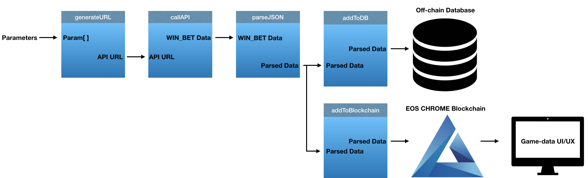

# IWC_DEV

## Background
IWC가 제공하는 플랫폼에서 구동되는 게임들은 모두 Bet&Win 데이터를 생성해내고 이러한 데이터는 IWC의 API Wallet의 searchTransactions API를 이용하여 추출할 수 있다.

IWC가 제공하는 게임의 특성상 각 회원의 Bet&Win 데이터는 게임 제공자뿐 아니라 각 회원에게도 매우 민감한 데이터라 할 수 있다. 온라인 카지노 게임의 특성상 모든 데이터에 접근 권한을 가진 게임 운영사는 자신이 원하는 대로 이 Bet&Win 데이터를 수정할 수 있으며, 실제로 이로 인한 많은 피해 사례가 존재한다. Bet&Win 데이터는 사용자 측면에서나 제공자 측면 양쪽에서 사용자의 잔액을 추적하기 위한 매우 중요한 데이터이며 투명히 공개되어야 하고 절대 임의로 수정되어서는 안 되는 민감한 데이터라 볼 수 있다.
이러한 중요한 데이터를 블록체인 위에 올림으로써 게임 회원들은 게임 제공자에 대한 신뢰를 얻을 수 있으며 게임 회사 또한 해당 데이터를 효과적으로 보관 및 활용할 수 있게 된다.

IWC는 게임 데이터를 블록체인화 하기 위해 아래와 같은 로직을 사용한다. 각 사각형 상자는 데이터를 처리하기 위한 하나의 데이터 처리 모듈을 뜻한다. 이러한 모듈은 사용 목적에 맞게 C++, Python, Shell Script, Node.js 등 여러 프로그래밍 언어로 작성된다.

첫번째 generateURL 모듈은 알맞은 파라미터를 인풋으로 받아 searchTransactions API를 불러오기 위한 URL을 생성한다. 생성된 URL로 접속을 하게 되면 파라미터를 통해 정하는 일정 기간 사이에 플레이 된 모든게임에 대한 Bet&Win 데이터를 XML 또는 JSON 형식으로 볼 수 있다.

두 번째 callAPI 모듈은 해당 URL에 접속하여 반환된 데이터를 로컬 컴퓨터로 다운을 받는 역할을 담당한다.
그러나 다운 받은 데이터를 그대로 사용하게 되면 결점이 있는 데이터가 반환되더라도 검증을 하지 못하고 다음 단계로 넘어가게 된다. 이러한 문제점은 세 번째 모듈이 핸들링한다.

세 번째 parseJSON 모듈은 API URL에서 받아온 Raw Data를 다음 모듈에 적합한 형태로 바꿔주며 동시에 받아온 데이터의 무결성을 검증한다. 이 모듈에서 나온 반환 값은 두 개의 다른 모듈로 전해지게 된다.

다음에 오는 두 모듈은 addToDB와 addToBlockchain 모듈로 모든 전 처리를 거친 데이터를 로컬 DB와 EOS CHROME 블록체인에 업로드 하는 역할을 한다. 같은 데이터를 신뢰성 높은 두 가지 매체에 저장함으로서 데이터에대한 신뢰성을 더 늘릴 수 있다.

최종 단말에서는 블록체인에 업로드되어 검열 저항성과 불변성이 보장된 Bet&Win 데이터를 손쉽게 검색하여 찾아 볼 수 있는 UI/UX를 제공한다.


## Schematics



## Architecture
IWC POC레벨 Dapp은 총 5개의 상위 모듈로 구성된다.

1. generate_url
2. call_api
3. parse_json
4. upload_data
5. UI/UX


### 1. generate_url
generate_url 모듈은 c++로 작성된다.
해당 모듈은 다양한 스트링값을 조합 및 헤쉬하여 api URL을 생성한다.
cpp파일 안에는 URL생성에 필요한 여러 파라미터가 하드코딩되어 있다. 보안을 위하여 private key등의 민감한 정보는
유저 인풋을 받아 구동한다.
내부적으로 스트링을 합치는 함수, 해쉬하는 함수, URL생성 함수등이 연동된다.

### 2. call_api
call_api 모듈은 c++과 shell script 언어로 작성된다.
call_api class는 append class에서 아웃풋된 api URL을 이용하여
api call을 한다. api 데이터를 cURL하여 json 파일로 저장하여 3번째 모듈로 넘겨준다.

### 3. parse_json
parse_json 모듈은 c++ 및 Python으로 작성된다.
Python 프로그램은 json 형식의 파일을 불러와 해당 api call의 성공 여부 및 트랜젝션 유무를 판단하고 알맞은 형태로 변형하여 반환한다.

### 4. upload_data
upload_data 모듈은 c++로 작성된다.
이 프로그램은 전처리가 된 api 데이터를 스트링 형태로 받아 MySQL DB에 각각 필드값에 알맞은 값을 추출하여 insert한다.
동시에 추출된 데이터를 EOS CHROME Blockchain의 chromemoney1 BP가 보유하는 Multi-index table에 맞는 형식으로 업로드 한다.

### 5. ui/ux
DB에 저장된 정보를 받아서 디스플레이.

## Data Handling
./log/archive_parsed.txt와 ./log/api_archive.json 파일에는 searchTransaction api call의 결과값을 모두 저장한다.
./log/average_upload_time.txt에는 모든 전처리가 끝난 트렌젝션 값 하나를 DB와 EOS CHROME 블록체인에 업로드하는데 드는 평균 시간을 ms 단위로 기록한다.

## Source Paths
```
├─ README.md
├─ image                         
│  ├─ IWC_EOSCHROME.png
├─ lib                              
├─ program
│  ├─ run.sh
│  ├─ walletpassword.txt
├─ src
│  ├─ contracts
│  │  ├─ contracts.abi
│  │  ├─ contracts.cpp
│  │  ├─ contracts.hpp
│  │  ├─ contracts.wasm
│  │  ├─ contracts.wast
│  ├─ add_to_db.cpp
│  ├─ api.sh
│  ├─ call_api.cpp
│  ├─ define.h
│  ├─ generate_url.cpp
│  ├─ main.cpp
│  ├─ md5hash.cpp
│  ├─ md5hash.h
│  ├─ parse.py
│  ├─ parse_json.cpp
```
